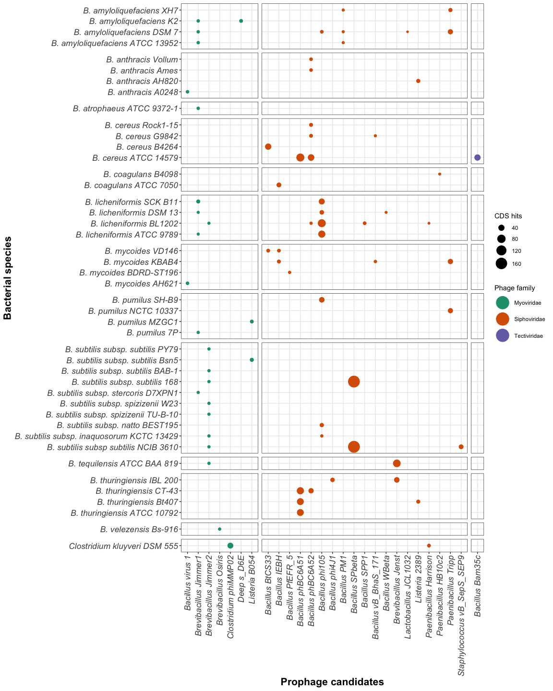

```{r setup, include=FALSE}
knitr::opts_chunk$set(cache=FALSE,  comment= " ", fig.path="Figs/", dev = c("png","pdf"))
# knitr::write_bib(c(.packages(), "knitr", "rmarkdown", "tidyverse"), "packages.bib")
knitr::write_bib(renv::dependencies()$Package, file = "packages.bib")
```

This repo hosts the complete PHASTER dataset from the 59 strains' genomes analyzed on PHASTER and several scripts developed for its processing. Analysis of this processed data is published on (paper). The primary packages used here are in the Tidyverse set of libraries, the rmarkdown and knitr packages were used to generate this report [@R-knitr; @R-rmarkdown; @tidyverse2019].

```{r libraries, include=FALSE, warning=FALSE, message=FALSE}
library(readr)
library(magrittr)
library(tibble)
library(dplyr)
library(stringr)
library(kableExtra)
library(tidyr)
library(ggplot2)
library(forcats)
library(datapasta)
```

# Data layers for the phylogenetic recosntruction (Fig 2.B-D) of **Bacillus** spp.


## Data importing and processing

The first step in this analysis is importing the summarized output that was created using the `populate_script()` after selecting each prophage prediction using de `datapasta` package [@R-datapasta].

<details open>
<summary>Predicted prophages retrieved on 2021-02-19</summary>

```{r dataset-importing, warning=FALSE, message=FALSE}
df_summaries <- read_tsv("Data/Raw/2021-02-19_PHASTER-summaries.tsv")
```

<p>...</p>
</details> 


## Fig 1B. Generating the number of biosynthetic gene clusters

Data from the the Biosynthetic Gene Clusters were retrieved for eacha species from different servers

## Fig 1C. Generating candidate prophages organized by completeness (Incomplete, Questionable, Intact)

<details open>
<summary> Prophage completeness code. </summary>

```{r prophage-completeness, message=FALSE}
by_completeness_raw <- df_summaries %>% 
  group_by(species,genome) %>%
  summarise(
    Incomplete = sum(str_count(completeness, "incomplete")),
    Questionable = sum(str_count(completeness, "questionable")),
    Intact = sum(str_count(completeness, "intact"))
  )

write_tsv(x = by_completeness_raw, "Data/Raw/completeness-01.tsv")
```

<p>...</p>
</details> 

## Fig 1D. Generating the total number of Restriciton modification systems per bacterial species

<details open>
<summary> RM system count import. </summary>

```{r Rm-proteins, message=FALSE}
rm_raw <- read_csv("Data/Raw/RMsystems-01.csv")
```

<p>...</p>
</details> 

Finally all data was processed by adding extra information necessary for applying as an extra layer of phylogenetic information:

```{zsh data-processed, echo = FALSE}
tree Data/Processed
```
For instance the BGCs data layer has the following information:

```{zsh head-processed, echo = FALSE}
head -11 Data/Processed/BGCs-iTOL-04.txt
```


# Fig S1. Bubbleplot of the intact prophages in each bacterial species.

For the purpose of wrap viral species into families we created this table assigning the current virus on the data set to its associated family:

<details close>
<summary> Prophage families population. </summary>

```{r phage-families, message=FALSE}
phage_family <- tribble(
  ~most_common_phage, ~phage_family,
  'Brevibacillus Jimmer1' , 'Myoviridae',
  'Brevibacillus Jimmer2' , 'Myoviridae',
  'Brevibacillus Abouo', 'Myoviridae',
  'Brevibacillus Jenst' , 'Siphoviridae',
  'Brevibacillus Osiris', 'Myoviridae',
  'Paenibacillus HB10c2' , 'Siphoviridae',
  'Paenibacillus Harrison' , 'Siphoviridae', 
  'Paenibacillus Tripp' , 'Siphoviridae',
  'Deep s_D6E' , 'Myoviridae',
  'Listeria 2389' , 'Siphoviridae',
  'Listeria A006' , 'Siphoviridae',
  'Listeria vB_LmoS_188', 'Siphoviridae',
  'Listeria B054', 'Myoviridae',
  'Thermus phi OH2' , 'Myoviridae',
  'Geobacillus E3', 'Siphoviridae',
  'Geobacillus GBSV1' , 'Myoviridae',
  'Staphylococcus vB_SepS_SEP9' , 'Siphoviridae',
  'Staphylococcus SPbeta_like' , 'Siphoviridae',
  'Clostridium phiCT9441A' , 'Myoviridae',
  'Clostridium phiCD27' , 'Myoviridae',
  'Clostridium phiMMP02' , 'Myoviridae',
  'Clostridium phiCD505', 'Myoviridae',
  'Clostridium phiCT453A', 'Myoviridae',
  'Clostridium phiSM101' , 'Siphoviridae',
  'Clostridium c_st', 'Siphoviridae',
  'Clostridium phiCD111', 'Siphoviridae',
  'Clostridium phiCD211', 'Siphoviridae',
  'Bacillus SPP1' , 'Siphoviridae',
  'Bacillus phi105' , 'Siphoviridae',
  'Bacillus virus 1' , 'Myoviridae',
  'Bacillus Bam35c' , 'Tectiviridae',
  'Bacillus phBC6A51' , 'Siphoviridae',
  'Bacillus phBC6A52' , 'Siphoviridae',
  'Bacillus PM1' , 'Siphoviridae',
  'Bacillus WBeta' , 'Siphoviridae',
  'Bacillus phIS3501' , 'Siphoviridae',
  'Bacillus BtCS33' , 'Siphoviridae',
  'Bacillus SPbeta' , 'Siphoviridae',
  'Bacillus phi4J1' , 'Siphoviridae',
  'Bacillus BalMu1' , 'Myoviridae',
  'Bacillus AR9', 'Myoviridae',
  'Bacillus Bam35c', 'Tectiviridae',
  'Bacillus Bobb' , 'Herelleveridae',
  'Bacillus BtCS33', 'Siphoviridae',
  'Bacillus Eyuki' , 'Herelleveridae',
  'Bacillus G', 'Myoviridae',
  'Bacillus IEBH', 'Siphoviridae',
  'Bacillus JBP901', 'Herelleveridae',
  'Bacillus JL', 'Herelleveridae',
  'Bacillus Palmer', 'Podoviridae',
  'Bacillus PBS1', 'Myoviridae',
  'Bacillus PfEFR_5', 'Siphoviridae',
  'Bacillus phiCM3', 'Siphoviridae',
  'Bacillus phiNIT1', 'Herelleveridae',
  'Bacillus Pony', 'Herelleveridae',
  'Bacillus SP_10', 'Herelleveridae',
  'Bacillus vB_BhaS_171', 'Siphoviridae',
  'Bacillus Waukesha92' , 'Siphoviridae',
  'Bacillus Finn', 'Siphoviridae',
  'Bacillus Fah', 'Siphoviridae',
  'Enterobacteria phi92', 'Myoviridae',
  'Enterococcus phiEf11', 'Siphoviridae',
  'Enterobacteria vB_KleM_RaK2', 'Myoviridae',
  'Lactobacillus JCL1032', 'Siphoviridae',
  'Lactobacillus phiAT3', 'Siphoviridae',
  'Planktothrix PaV_LD', 'Siphoviridae',
  'Sphingomonas PAU', 'Myoviridae',
  'Cellulophaga phiSM', 'Myoviridae',
  'Staphylococcus SpaA1' , 'Siphoviridae',
  'Synechococcus S_SKS1' , 'Myoviridae',
  'Escherichia RCS47' , 'Myoviridae'
)
```

<p>...</p>
</details> 

```{r phage-families-02, echo=FALSE}
kable(phage_family[1:10,])
```

***

The previous table is then joined to the main dataset and complements it. To find the prophage candidates from PHASTER data we evaluated the summary information. In this approach the *most common phage* is directly detected from PHASTER and its criteria is based on adding unidentified prophage proteins to the PHAGE with most proteins already identified using sequence similarity of the non identified proteins.

<details close>
<summary> Intact prophages per bacteria </summary>

```{r intact-phages, fig.height=15, fig.width=12, warning=FALSE, message=FALSE}
intact_phages_summary_cleaned <- df_summaries %>%
  separate(most_common_phage, c("most_common_phage", "phage_proteins"), sep = "\\(") %>%
  relocate(species) %>%
  arrange(species) %>%
  mutate(
    phage_proteins = str_replace(phage_proteins, "\\)", ""),
    most_common_phage = str_remove(most_common_phage, "PHAGE_"),
    species = str_replace(species, "Bacillus", "B."),
    species = as.factor(species),
    phage_proteins = as.numeric(phage_proteins),
    most_common_phage = str_replace(most_common_phage, "_", " "),
    most_common_phage = str_replace(most_common_phage, "Bacill", "Bacillus"),
    most_common_phage = str_replace(most_common_phage, "Brevib", "Brevibacillus"),
    most_common_phage = str_replace(most_common_phage, "Clostr", "Clostridium"),
    most_common_phage = str_replace(most_common_phage, "Thermu", "Thermus phi"),
    most_common_phage = str_replace(most_common_phage, "Paenib", "Paenibacillus"),
    most_common_phage = str_replace(most_common_phage, "Bacillus 1", "Bacillus virus 1"),
    most_common_phage = str_replace(most_common_phage, "Lister", "Listeria"),
    most_common_phage = str_replace(most_common_phage, "Geobac", "Geobacillus"),
    most_common_phage = str_replace(most_common_phage, "Staphy", "Staphylococcus"),
    most_common_phage = str_replace(most_common_phage, "Entero phi92", "Enterobacteria phi92"),
    most_common_phage = str_replace(most_common_phage, "Entero phiEf11", "Enterococcus phiEf11"),
    most_common_phage = str_replace(most_common_phage, "Entero vB_KleM_RaK2", "Enterobacteria vB_KleM_RaK2"),
    most_common_phage = str_replace(most_common_phage, "Lactob", "Lactobacillus"),
    most_common_phage = str_replace(most_common_phage, "Sphing", "Sphingomonas"),
    most_common_phage = str_replace(most_common_phage, "Cellul", "Cellulophaga"),
    most_common_phage = str_replace(most_common_phage, "Plankt", "Planktothrix"),
    most_common_phage = str_replace(most_common_phage, "Synech", "Synechococcus"),
    most_common_phage = str_replace(most_common_phage, "Escher", "Escherichia")
  ) %>%
  separate(most_common_phage, c("most_common_phage", "phage_nc_id"), sep = "_NC_") %>%
  inner_join(phage_family)
```

<p>...</p>
</details> 

***

Using the organized data from intact prophages we then plot the best prediction per bacteria and their associated CDSs.

<details close>
<summary> Bubbleplot of intact prophages per bacteria </summary>

```{r bubbleplot-summary, fig.height=15, fig.width=12, warning=FALSE, message=FALSE}
bubbleplot_plot_summary <- intact_phages_summary_cleaned %>% 
  filter(completeness == "intact") %>%
  select(species, most_common_phage, phage_proteins, phage_family) %>%
  mutate(epithet = as_factor(word(species,2))) %>% 
  pivot_wider(names_from = "most_common_phage", values_from = "phage_proteins", values_fill = 0, values_fn = sum) %>% 
  pivot_longer(cols = -c(species, epithet, phage_family), names_to = "most_common_phage", values_to = "phage_proteins") %>%
  filter(phage_proteins > 0) %>%
  ggplot(aes(most_common_phage, species, size = phage_proteins, color = phage_family)) +
  geom_point() +
  facet_grid(rows = vars(epithet), scales = "free", space = "free") +
  theme_bw() +
  scale_size_area(max_size = 8) +
  scale_color_brewer(palette = "Dark2") +
  facet_grid(rows = vars(epithet), cols = vars(phage_family), scales = "free", space = "free") +
  guides(color = guide_legend(override.aes = list(size=9))) +
  theme(
    axis.text.x = element_text(angle = 90, vjust = 0.5, hjust = 1, size = 13, face = "italic"),
    axis.text.y = element_text(size = 13, face = "italic"),
    axis.title.x = element_text(size = 16, face = "bold"),
    axis.title.y = element_text(size = 16, face = "bold"),
    strip.background = element_blank(),
    strip.text.y = element_blank(),
    strip.text.x = element_blank(),
    legend.position = "right"
  ) +
  labs(
    x = "Prophage candidates",
    y = "Bacterial species",
    size = "CDS hits",
    color = "Phage family"
)

# bubbleplot_plot_summary
```

<p>...</p>
</details> 



## License

<a rel="license" href="http://creativecommons.org/licenses/by/4.0/"></a><br />This work is licensed under a <a rel="license" href="http://creativecommons.org/licenses/by/4.0/">Creative Commons Attribution 4.0 International License</a>.


## References
