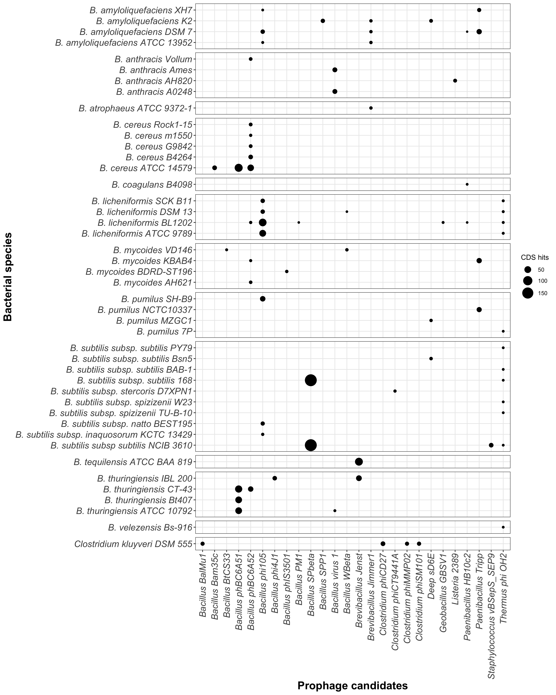

Data procesing on PHASTER output dataset
================

This repo hosts the complete PHASTER dataset from the 59 strains’
genomes analysed on PHASTER and several scripts developed for its
processing. Analysis of this processed data is published on (paper). The
primary packages used here are in the Tidyverse set of libraries, the
rmarkdown and knitr packages were used to generate this report (Xie
2020; Allaire et al. 2020; Wickham et al. 2019).

## Libraries

``` r
library(tidyverse) 
library(magrittr)
library(readxl) 
library(rmarkdown)
library(knitr)
```

## Data importing and processing

The first step in this analysis is transforming the XSLSX file into a
friendly data frame for R.

``` r
df <- read_excel("Data/2020-09-07_PHASTER-raw.xlsx")
df %<>% mutate_at(vars(e_value), ~ as.numeric(as.character(.)))
df %<>% mutate_at(vars(species,completeness, genome), ~ as_factor(.))

kable(df[1:5,])
```

| species                               | genome     | completeness | score | region | hit\_number | cds\_position                | blast\_hit                      | e\_value | Source  |
| :------------------------------------ | :--------- | :----------- | ----: | -----: | ----------: | :--------------------------- | :------------------------------ | -------: | :------ |
| Bacillus amyloliquefaciens ATCC 13952 | CP009748.1 | Questionable |    70 |      1 |           1 | 1114538..1115125             | spore coat protein; KS08\_05605 |       NA | Genomic |
| Bacillus amyloliquefaciens ATCC 13952 | CP009748.1 | Questionable |    70 |      1 |           2 | complement(1115183..1115626) | spore coat protein; KS08\_05610 |       NA | Genomic |
| Bacillus amyloliquefaciens ATCC 13952 | CP009748.1 | Questionable |    70 |      1 |           3 | complement(1115775..1116257) | spore coat protein; KS08\_05615 |       NA | Genomic |
| Bacillus amyloliquefaciens ATCC 13952 | CP009748.1 | Questionable |    70 |      1 |           4 | complement(1116407..1116907) | spore coat protein; KS08\_05620 |       NA | Genomic |
| Bacillus amyloliquefaciens ATCC 13952 | CP009748.1 | Questionable |    70 |      1 |           5 | complement(1117000..1117314) | spore coat protein; KS08\_05625 |       NA | Genomic |

## Fig 1. Generating candiadates prophage organized by completeness (Incomplete, Questionable, Intact)

``` r
by_completeness <- df %>%
  filter(hit_number == 1) %>% 
  group_by(species,genome) %>%
  summarise(
    Incomplete = sum(str_count(completeness, "Incomplete")),
    Questionable = sum(str_count(completeness, "Questionable")),
    Intact = sum(str_count(completeness, "Intact"))
  )

#write_tsv(x = by_completeness, path = "Data/completeness_raw-01.tsv")

kable(by_completeness[1:5,])
```

| species                                   | genome         | Incomplete | Questionable | Intact |
| :---------------------------------------- | :------------- | ---------: | -----------: | -----: |
| Bacillus amyloliquefaciens ATCC 13952     | CP009748.1     |          3 |            4 |      2 |
| Bacillus mycoides ATCC 6462               | CP009692.1     |          3 |            5 |      0 |
| Bacillus amyloliquefaciens K2             | MOEA01000001.1 |          4 |            1 |      3 |
| Bacillus anthracis Rock3-42               | CM000732.1     |          2 |            0 |      0 |
| Bacillus subtilis subsp. stercoris D7XPN1 | JHCA01000001.1 |          0 |            0 |      1 |

## Fig 1. Generating the total number of prophage proteins per bacteria species

``` r
by_species_total <- df %>%
  group_by(species, genome) %>%
  summarise("Total prophage proteins" = sum(str_count(blast_hit, "PHAGE")))

#write_tsv(x = by_species_total, path = "Data/total-proteins_raw-01.tsv")

kable(by_species_total[1:5,])
```

| species                                   | genome         | Total prophage proteins |
| :---------------------------------------- | :------------- | ----------------------: |
| Bacillus amyloliquefaciens ATCC 13952     | CP009748.1     |                     268 |
| Bacillus mycoides ATCC 6462               | CP009692.1     |                     121 |
| Bacillus amyloliquefaciens K2             | MOEA01000001.1 |                     189 |
| Bacillus anthracis Rock3-42               | CM000732.1     |                      49 |
| Bacillus subtilis subsp. stercoris D7XPN1 | JHCA01000001.1 |                      36 |

## Fig S1. Generating the dataset of the intact prophages in each bacterial species and vizualizing on a bubble-plot.

``` r
intact_phages <- df %>%
  filter(completeness %in% c("Intact") & blast_hit %in% str_subset(blast_hit, "^PHAGE")) %>%
  mutate(Candidate = as.factor(str_extract(blast_hit, "[:graph:]+(?=:)")), region = as.factor(region)) %>%
  mutate(Candidate = str_remove(Candidate, "PHAGE_"), Candidate = str_replace(Candidate, "_", " ")) %>%
  mutate(species = str_replace(species,"Bacillus", "B.")) %>% 
  separate(Candidate, c("Candidate", "Phage_NC_ID"), sep = "_NC_") %>%
  mutate(Candidate = str_remove(Candidate, "_")) %>% 
  select(species, score, region, Candidate, Phage_NC_ID) %>% 
  group_by(species, Candidate, region, score, Phage_NC_ID) %>% 
  summarise(
    CDS_hits = length(Candidate)
  ) %>% 
  group_by(species, region) %>% 
  filter(CDS_hits == max(CDS_hits)) %>% 
  mutate(Epithet = as_factor(word(species,2)))

#write_tsv(x = intact_phages, path = "Data/intact-phages_raw-01.tsv")

kable(intact_phages[1:5,])
```

| species                         | Candidate      | region | score | Phage\_NC\_ID | CDS\_hits | Epithet           |
| :------------------------------ | :------------- | :----- | ----: | :------------ | --------: | :---------------- |
| B. amyloliquefaciens ATCC 13952 | Bacill phi105  | 7      |   150 | 004167        |         6 | amyloliquefaciens |
| B. amyloliquefaciens ATCC 13952 | Brevib Jimmer1 | 4      |   150 | 029104        |         9 | amyloliquefaciens |
| B. amyloliquefaciens DSM 7      | Bacill phi105  | 2      |   150 | 004167        |         3 | amyloliquefaciens |
| B. amyloliquefaciens DSM 7      | Bacill phi105  | 6      |   140 | 004167        |         6 | amyloliquefaciens |
| B. amyloliquefaciens DSM 7      | Bacill phi105  | 7      |   130 | 004167        |         9 | amyloliquefaciens |

-----

``` r
intact_phages %>%
  as_tibble() %>%
  mutate(Species = species) %>%
  select(Species, Candidate, CDS_hits, Epithet) %>%
  pivot_wider(names_from = "Candidate", values_from = "CDS_hits", values_fill = 0, values_fn = sum) %>%
  pivot_longer(cols = -c(Species, Epithet), names_to = "Candidates", values_to = "CDS hits") %>%
  filter(`CDS hits`>1) %>% 
  ggplot(aes(Candidates, Species, size = `CDS hits`)) +
  geom_point() +
  facet_grid(rows = vars(Epithet), scales = "free", space = "free") +
  theme_bw() +
  theme(axis.text.x = element_text(angle = 90, vjust = 0.5, hjust = 1, size = 14, face = "italic"),
        axis.text.y = element_text(size = 14, face = "italic"),
        axis.title.x = element_text(size = 17, face = "bold"),
        axis.title.y = element_text(size = 17, face = "bold"),
        strip.background = element_blank(),
        strip.text = element_blank(),
        legend.position = "right"
        ) +
  labs(x = "Prophage candidates",
       y = "Bacterial species"
  )
```



## License

<a rel="license" href="http://creativecommons.org/licenses/by/4.0/"></a><br />This
work is licensed under a
<a rel="license" href="http://creativecommons.org/licenses/by/4.0/">Creative
Commons Attribution 4.0 International License</a>.

## References

<div id="refs" class="references">

<div id="ref-R-rmarkdown">

Allaire, JJ, Yihui Xie, Jonathan McPherson, Javier Luraschi, Kevin
Ushey, Aron Atkins, Hadley Wickham, Joe Cheng, Winston Chang, and
Richard Iannone. 2020. *Rmarkdown: Dynamic Documents for R*.
<https://CRAN.R-project.org/package=rmarkdown>.

</div>

<div id="ref-tidyverse2019">

Wickham, Hadley, Mara Averick, Jennifer Bryan, Winston Chang, Lucy
D’Agostino McGowan, Romain François, Garrett Grolemund, et al. 2019.
“Welcome to the tidyverse.” *Journal of Open Source Software* 4 (43):
1686. <https://doi.org/10.21105/joss.01686>.

</div>

<div id="ref-R-knitr">

Xie, Yihui. 2020. *Knitr: A General-Purpose Package for Dynamic Report
Generation in R*. <https://CRAN.R-project.org/package=knitr>.

</div>

</div>
