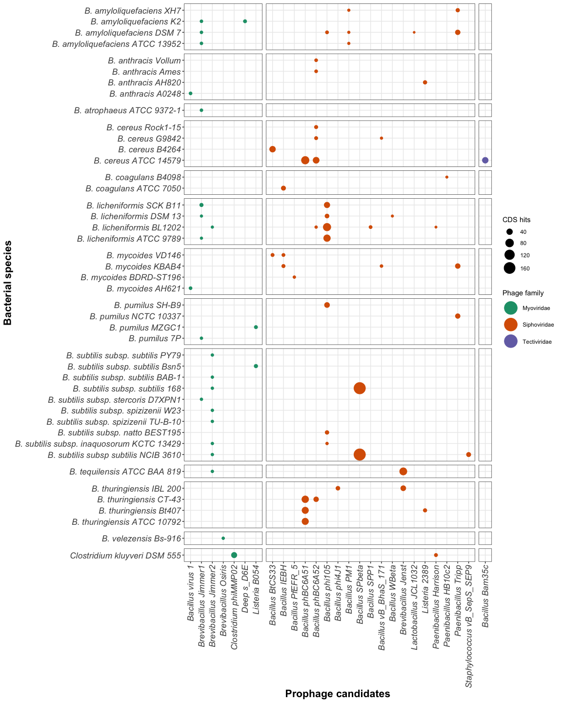

Data procesing on PHASTER output dataset
================

This repo hosts the complete PHASTER dataset from the 59 strains’
genomes analyzed on PHASTER and several scripts developed for its
processing. Analysis of this processed data is published on (paper). The
primary packages used here are in the Tidyverse set of libraries, the
rmarkdown and knitr packages were used to generate this report (Xie
2021; Allaire et al. 2021; Wickham et al. 2019).

# Data layers for the phylogenetic recosntruction (Fig 2.B-D) of **Bacillus** spp.

## Data importing and processing

The first step in this analysis is importing the summarized output that
was created using the `populate_script()` after selecting each prophage
prediction using de `datapasta` package (McBain et al. 2021).

<details open>
<summary>
Predicted prophages retrieved on 2021-02-19
</summary>

``` r
df_summaries <- read_tsv("Data/Raw/2021-02-19_PHASTER-summaries.tsv")
```

<p>
…
</p>
</details>

## Fig 1B. Generating the number of biosynthetic gene clusters

Data from the the Biosynthetic Gene Clusters were retrieved for eacha
species from different servers

## Fig 1C. Generating candidate prophages organized by completeness (Incomplete, Questionable, Intact)

<details open>
<summary>
Prophage completeness code.
</summary>

``` r
by_completeness_raw <- df_summaries %>% 
  group_by(species,genome) %>%
  summarise(
    Incomplete = sum(str_count(completeness, "incomplete")),
    Questionable = sum(str_count(completeness, "questionable")),
    Intact = sum(str_count(completeness, "intact"))
  )

write_tsv(x = by_completeness_raw, "Data/Raw/completeness-01.tsv")
```

<p>
…
</p>
</details>

## Fig 1D. Generating the total number of Restriciton modification systems per bacterial species

<details open>
<summary>
RM system count import.
</summary>

``` r
rm_raw <- read_csv("Data/Raw/RMsystems-01.csv")
```

<p>
…
</p>
</details>

# Fig S1. Bubbleplot of the intact prophages in each bacterial species.

For the purpose of wrap viral species into families we created this
table assigning the current virus on the data set to its associated
family:

<details close>
<summary>
Prophage families population.
</summary>

``` r
phage_family <- tribble(
  ~most_common_phage, ~phage_family,
  'Brevibacillus Jimmer1' , 'Myoviridae',
  'Brevibacillus Jimmer2' , 'Myoviridae',
  'Brevibacillus Abouo', 'Myoviridae',
  'Brevibacillus Jenst' , 'Siphoviridae',
  'Brevibacillus Osiris', 'Myoviridae',
  'Paenibacillus HB10c2' , 'Siphoviridae',
  'Paenibacillus Harrison' , 'Siphoviridae', 
  'Paenibacillus Tripp' , 'Siphoviridae',
  'Deep s_D6E' , 'Myoviridae',
  'Listeria 2389' , 'Siphoviridae',
  'Listeria A006' , 'Siphoviridae',
  'Listeria vB_LmoS_188', 'Siphoviridae',
  'Listeria B054', 'Myoviridae',
  'Thermus phi OH2' , 'Myoviridae',
  'Geobacillus E3', 'Siphoviridae',
  'Geobacillus GBSV1' , 'Myoviridae',
  'Staphylococcus vB_SepS_SEP9' , 'Siphoviridae',
  'Staphylococcus SPbeta_like' , 'Siphoviridae',
  'Clostridium phiCT9441A' , 'Myoviridae',
  'Clostridium phiCD27' , 'Myoviridae',
  'Clostridium phiMMP02' , 'Myoviridae',
  'Clostridium phiCD505', 'Myoviridae',
  'Clostridium phiCT453A', 'Myoviridae',
  'Clostridium phiSM101' , 'Siphoviridae',
  'Clostridium c_st', 'Siphoviridae',
  'Clostridium phiCD111', 'Siphoviridae',
  'Clostridium phiCD211', 'Siphoviridae',
  'Bacillus SPP1' , 'Siphoviridae',
  'Bacillus phi105' , 'Siphoviridae',
  'Bacillus virus 1' , 'Myoviridae',
  'Bacillus Bam35c' , 'Tectiviridae',
  'Bacillus phBC6A51' , 'Siphoviridae',
  'Bacillus phBC6A52' , 'Siphoviridae',
  'Bacillus PM1' , 'Siphoviridae',
  'Bacillus WBeta' , 'Siphoviridae',
  'Bacillus phIS3501' , 'Siphoviridae',
  'Bacillus BtCS33' , 'Siphoviridae',
  'Bacillus SPbeta' , 'Siphoviridae',
  'Bacillus phi4J1' , 'Siphoviridae',
  'Bacillus BalMu1' , 'Myoviridae',
  'Bacillus AR9', 'Myoviridae',
  'Bacillus Bam35c', 'Tectiviridae',
  'Bacillus Bobb' , 'Herelleveridae',
  'Bacillus BtCS33', 'Siphoviridae',
  'Bacillus Eyuki' , 'Herelleveridae',
  'Bacillus G', 'Myoviridae',
  'Bacillus IEBH', 'Siphoviridae',
  'Bacillus JBP901', 'Herelleveridae',
  'Bacillus JL', 'Herelleveridae',
  'Bacillus Palmer', 'Podoviridae',
  'Bacillus PBS1', 'Myoviridae',
  'Bacillus PfEFR_5', 'Siphoviridae',
  'Bacillus phiCM3', 'Siphoviridae',
  'Bacillus phiNIT1', 'Herelleveridae',
  'Bacillus Pony', 'Herelleveridae',
  'Bacillus SP_10', 'Herelleveridae',
  'Bacillus vB_BhaS_171', 'Siphoviridae',
  'Bacillus Waukesha92' , 'Siphoviridae',
  'Bacillus Finn', 'Siphoviridae',
  'Bacillus Fah', 'Siphoviridae',
  'Enterobacteria phi92', 'Myoviridae',
  'Enterococcus phiEf11', 'Siphoviridae',
  'Enterobacteria vB_KleM_RaK2', 'Myoviridae',
  'Lactobacillus JCL1032', 'Siphoviridae',
  'Lactobacillus phiAT3', 'Siphoviridae',
  'Planktothrix PaV_LD', 'Siphoviridae',
  'Sphingomonas PAU', 'Myoviridae',
  'Cellulophaga phiSM', 'Myoviridae',
  'Staphylococcus SpaA1' , 'Siphoviridae',
  'Synechococcus S_SKS1' , 'Myoviridae',
  'Escherichia RCS47' , 'Myoviridae'
)

kable(phage_family[1:5,])
```

<table>
<thead>
<tr>
<th style="text-align:left;">
most\_common\_phage
</th>
<th style="text-align:left;">
phage\_family
</th>
</tr>
</thead>
<tbody>
<tr>
<td style="text-align:left;">
Brevibacillus Jimmer1
</td>
<td style="text-align:left;">
Myoviridae
</td>
</tr>
<tr>
<td style="text-align:left;">
Brevibacillus Jimmer2
</td>
<td style="text-align:left;">
Myoviridae
</td>
</tr>
<tr>
<td style="text-align:left;">
Brevibacillus Abouo
</td>
<td style="text-align:left;">
Myoviridae
</td>
</tr>
<tr>
<td style="text-align:left;">
Brevibacillus Jenst
</td>
<td style="text-align:left;">
Siphoviridae
</td>
</tr>
<tr>
<td style="text-align:left;">
Brevibacillus Osiris
</td>
<td style="text-align:left;">
Myoviridae
</td>
</tr>
</tbody>
</table>
<p>
…
</p>
</details>

------------------------------------------------------------------------

The previous table is then joined to the main dataset and complements
it. To find the prophage candidates from PHASTER data we evaluated the
summary information. In this approach the *most common phage* is
directly detected from PHASTER and its criteria is based on adding
unidentified prophage proteins to the PHAGE with most proteins already
identified using sequence similarity of the non identified proteins.

<details close>
<summary>
Intact prophages per bacteria
</summary>

``` r
intact_phages_summary_cleaned <- df_summaries %>%
  separate(most_common_phage, c("most_common_phage", "phage_proteins"), sep = "\\(") %>%
  relocate(species) %>%
  arrange(species) %>%
  mutate(
    phage_proteins = str_replace(phage_proteins, "\\)", ""),
    most_common_phage = str_remove(most_common_phage, "PHAGE_"),
    species = str_replace(species, "Bacillus", "B."),
    species = as.factor(species),
    phage_proteins = as.numeric(phage_proteins),
    most_common_phage = str_replace(most_common_phage, "_", " "),
    most_common_phage = str_replace(most_common_phage, "Bacill", "Bacillus"),
    most_common_phage = str_replace(most_common_phage, "Brevib", "Brevibacillus"),
    most_common_phage = str_replace(most_common_phage, "Clostr", "Clostridium"),
    most_common_phage = str_replace(most_common_phage, "Thermu", "Thermus phi"),
    most_common_phage = str_replace(most_common_phage, "Paenib", "Paenibacillus"),
    most_common_phage = str_replace(most_common_phage, "Bacillus 1", "Bacillus virus 1"),
    most_common_phage = str_replace(most_common_phage, "Lister", "Listeria"),
    most_common_phage = str_replace(most_common_phage, "Geobac", "Geobacillus"),
    most_common_phage = str_replace(most_common_phage, "Staphy", "Staphylococcus"),
    most_common_phage = str_replace(most_common_phage, "Entero phi92", "Enterobacteria phi92"),
    most_common_phage = str_replace(most_common_phage, "Entero phiEf11", "Enterococcus phiEf11"),
    most_common_phage = str_replace(most_common_phage, "Entero vB_KleM_RaK2", "Enterobacteria vB_KleM_RaK2"),
    most_common_phage = str_replace(most_common_phage, "Lactob", "Lactobacillus"),
    most_common_phage = str_replace(most_common_phage, "Sphing", "Sphingomonas"),
    most_common_phage = str_replace(most_common_phage, "Cellul", "Cellulophaga"),
    most_common_phage = str_replace(most_common_phage, "Plankt", "Planktothrix"),
    most_common_phage = str_replace(most_common_phage, "Synech", "Synechococcus"),
    most_common_phage = str_replace(most_common_phage, "Escher", "Escherichia")
  ) %>%
  separate(most_common_phage, c("most_common_phage", "phage_nc_id"), sep = "_NC_") %>%
  inner_join(phage_family)
```

<p>
…
</p>
</details>

------------------------------------------------------------------------

Using the organized data from intact prophages we then plot the best
prediction per bacteria and their associated CDSs.

<details close>
<summary>
Bubbleplot of intact prophages per bacteria
</summary>

``` r
bubbleplot_plot_summary <- intact_phages_summary_cleaned %>% 
  filter(completeness == "intact") %>%
  select(species, most_common_phage, phage_proteins, phage_family) %>%
  mutate(epithet = as_factor(word(species,2))) %>% 
  pivot_wider(names_from = "most_common_phage", values_from = "phage_proteins", values_fill = 0, values_fn = sum) %>% 
  pivot_longer(cols = -c(species, epithet, phage_family), names_to = "most_common_phage", values_to = "phage_proteins") %>%
  filter(phage_proteins > 0) %>%
  ggplot(aes(most_common_phage, species, size = phage_proteins, color = phage_family)) +
  geom_point() +
  facet_grid(rows = vars(epithet), scales = "free", space = "free") +
  theme_bw() +
  scale_size_area(max_size = 8) +
  scale_color_brewer(palette = "Dark2") +
  facet_grid(rows = vars(epithet), cols = vars(phage_family), scales = "free", space = "free") +
  guides(color = guide_legend(override.aes = list(size=9))) +
  theme(
    axis.text.x = element_text(angle = 90, vjust = 0.5, hjust = 1, size = 13, face = "italic"),
    axis.text.y = element_text(size = 13, face = "italic"),
    axis.title.x = element_text(size = 16, face = "bold"),
    axis.title.y = element_text(size = 16, face = "bold"),
    strip.background = element_blank(),
    strip.text.y = element_blank(),
    strip.text.x = element_blank(),
    legend.position = "right"
  ) +
  labs(
    x = "Prophage candidates",
    y = "Bacterial species",
    size = "CDS hits",
    color = "Phage family"
)

# ggsave("Figs/bubbleplot-summary-01.pdf", width = 14, height = 16)

# bubbleplot_plot_summary
```

<p>
…
</p>
</details>



## License

<a rel="license" href="http://creativecommons.org/licenses/by/4.0/"></a><br />This
work is licensed under a
<a rel="license" href="http://creativecommons.org/licenses/by/4.0/">Creative
Commons Attribution 4.0 International License</a>.

## References

<div id="refs" class="references csl-bib-body hanging-indent">

<div id="ref-R-rmarkdown" class="csl-entry">

Allaire, JJ, Yihui Xie, Jonathan McPherson, Javier Luraschi, Kevin
Ushey, Aron Atkins, Hadley Wickham, Joe Cheng, Winston Chang, and
Richard Iannone. 2021. *Rmarkdown: Dynamic Documents for r*.
<https://CRAN.R-project.org/package=rmarkdown>.

</div>

<div id="ref-R-magrittr" class="csl-entry">

Bache, Stefan Milton, and Hadley Wickham. 2020. *Magrittr: A
Forward-Pipe Operator for r*.
<https://CRAN.R-project.org/package=magrittr>.

</div>

<div id="ref-R-datapasta" class="csl-entry">

McBain, Miles, Jonathan Carroll, Sharla Gelfand, Suthira Owlarn, and
Garrick Aden-Buie. 2021. *Datapasta: R Tools for Data Copy-Pasta*.
<https://github.com/milesmcbain/datapasta>.

</div>

<div id="ref-R-tibble" class="csl-entry">

Müller, Kirill, and Hadley Wickham. 2021. *Tibble: Simple Data Frames*.
<https://CRAN.R-project.org/package=tibble>.

</div>

<div id="ref-R-renv" class="csl-entry">

Ushey, Kevin. 2021. *Renv: Project Environments*.
<https://rstudio.github.io/renv/>.

</div>

<div id="ref-ggplot22016" class="csl-entry">

Wickham, Hadley. 2016. *Ggplot2: Elegant Graphics for Data Analysis*.
Springer-Verlag New York. <https://ggplot2.tidyverse.org>.

</div>

<div id="ref-R-stringr" class="csl-entry">

———. 2019. *Stringr: Simple, Consistent Wrappers for Common String
Operations*. <https://CRAN.R-project.org/package=stringr>.

</div>

<div id="ref-R-forcats" class="csl-entry">

———. 2021a. *Forcats: Tools for Working with Categorical Variables
(Factors)*. <https://CRAN.R-project.org/package=forcats>.

</div>

<div id="ref-R-tidyr" class="csl-entry">

———. 2021b. *Tidyr: Tidy Messy Data*.
<https://CRAN.R-project.org/package=tidyr>.

</div>

<div id="ref-R-tidyverse" class="csl-entry">

———. 2021c. *Tidyverse: Easily Install and Load the Tidyverse*.
<https://CRAN.R-project.org/package=tidyverse>.

</div>

<div id="ref-tidyverse2019" class="csl-entry">

Wickham, Hadley, Mara Averick, Jennifer Bryan, Winston Chang, Lucy
D’Agostino McGowan, Romain François, Garrett Grolemund, et al. 2019.
“Welcome to the <span class="nocase">tidyverse</span>.” *Journal of Open
Source Software* 4 (43): 1686. <https://doi.org/10.21105/joss.01686>.

</div>

<div id="ref-R-ggplot2" class="csl-entry">

Wickham, Hadley, Winston Chang, Lionel Henry, Thomas Lin Pedersen,
Kohske Takahashi, Claus Wilke, Kara Woo, Hiroaki Yutani, and Dewey
Dunnington. 2021. *Ggplot2: Create Elegant Data Visualisations Using the
Grammar of Graphics*. <https://CRAN.R-project.org/package=ggplot2>.

</div>

<div id="ref-R-dplyr" class="csl-entry">

Wickham, Hadley, Romain François, Lionel Henry, and Kirill Müller. 2021.
*Dplyr: A Grammar of Data Manipulation*.
<https://CRAN.R-project.org/package=dplyr>.

</div>

<div id="ref-R-readr" class="csl-entry">

Wickham, Hadley, and Jim Hester. 2021. *Readr: Read Rectangular Text
Data*. <https://CRAN.R-project.org/package=readr>.

</div>

<div id="ref-knitr2014" class="csl-entry">

Xie, Yihui. 2014. “Knitr: A Comprehensive Tool for Reproducible Research
in R.” In *Implementing Reproducible Computational Research*, edited by
Victoria Stodden, Friedrich Leisch, and Roger D. Peng. Chapman;
Hall/CRC. <http://www.crcpress.com/product/isbn/9781466561595>.

</div>

<div id="ref-knitr2015" class="csl-entry">

———. 2015. *Dynamic Documents with R and Knitr*. 2nd ed. Boca Raton,
Florida: Chapman; Hall/CRC. <https://yihui.org/knitr/>.

</div>

<div id="ref-R-knitr" class="csl-entry">

———. 2021. *Knitr: A General-Purpose Package for Dynamic Report
Generation in r*. <https://yihui.org/knitr/>.

</div>

<div id="ref-rmarkdown2018" class="csl-entry">

Xie, Yihui, J. J. Allaire, and Garrett Grolemund. 2018. *R Markdown: The
Definitive Guide*. Boca Raton, Florida: Chapman; Hall/CRC.
<https://bookdown.org/yihui/rmarkdown>.

</div>

<div id="ref-rmarkdown2020" class="csl-entry">

Xie, Yihui, Christophe Dervieux, and Emily Riederer. 2020. *R Markdown
Cookbook*. Boca Raton, Florida: Chapman; Hall/CRC.
<https://bookdown.org/yihui/rmarkdown-cookbook>.

</div>

<div id="ref-R-kableExtra" class="csl-entry">

Zhu, Hao. 2021. *kableExtra: Construct Complex Table with Kable and Pipe
Syntax*. <https://CRAN.R-project.org/package=kableExtra>.

</div>

</div>
